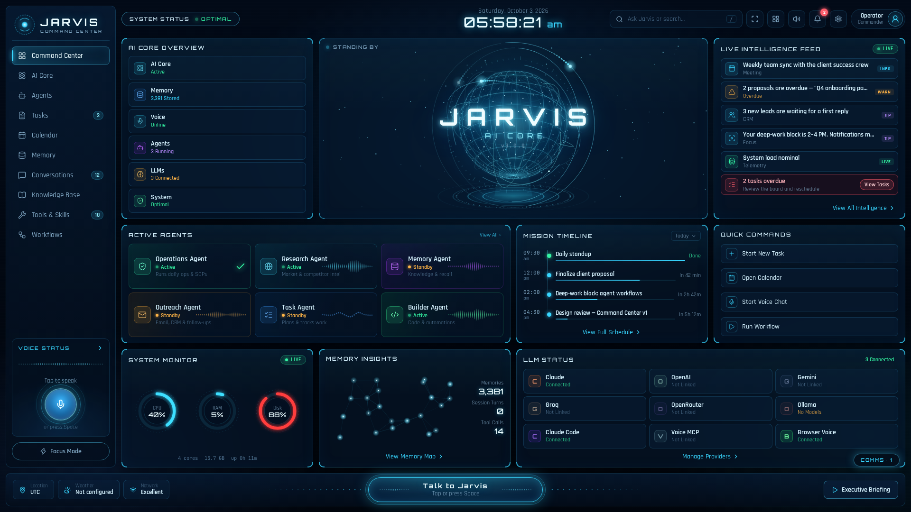

# The People Persons — JARVIS Command Center



A voice-driven command center for running the business with a team of AI agents.
This first milestone is the **Jarvis interface**: a holographic HUD that listens,
talks back and shows live system telemetry. Agents, skills, workflows and a
Voice MCP plug into it next.

## Quick start

Requires **Node.js 20+**.

```bash
git clone https://github.com/riverboatventures/the-people-persons-solution.git
cd the-people-persons-solution
npm install
npm run dev
```

Open **http://localhost:5173** in **Chrome or Edge** (they support the browser's
speech recognition), click **Engage**, and allow microphone access when asked.

To build once and serve everything from a single port:

```bash
npm start          # builds, then serves UI + API on http://localhost:4317
```

## Talking to Jarvis

| Action | How |
| --- | --- |
| Speak | Press **Space**, click the globe, the mic orb or **Talk to Jarvis** |
| Type a command | Press **/** to use the top bar, or the Comms Log input |
| Stop speech or close the log | **Esc** |
| Mute Jarvis' voice | Speaker icon in the top bar |

Commands it understands today include: *"give me my briefing"*, *"system status"*,
*"what's on my schedule"*, *"show my agents"*, *"turn on focus mode"*,
*"what time is it"*, *"start a new task"* and *"run workflow"*.

## Configuration

Copy `.env.example` to `.env` and adjust:

- `VITE_OPERATOR_NAME`: the name Jarvis greets you by
- `VITE_LOCATION_NAME`, `VITE_WEATHER_LAT`, `VITE_WEATHER_LON`, `VITE_WEATHER_UNIT`: location label and live weather (Open-Meteo, no API key needed)
- `JARVIS_API_PORT`: local API port (default `4317`)

## Project layout

```
server/index.js          Local API: live CPU/RAM/disk at /api/system; serves the built UI
src/App.tsx              Dashboard composition, keyboard shortcuts, action routing
src/hooks/useVoice.ts    Listen (Web Speech API) + speak (speechSynthesis) + mic analyser
src/jarvis/brain.ts      Local intent router; becomes the gateway to the agent orchestrator
src/components/          HUD panels: JarvisCore (animated globe), agents, feed, timeline…
src/data/dashboard.ts    Seed data (agents, feed, missions, LLMs) to be replaced by live sources
```

## Roadmap

1. ✅ Jarvis interface: HUD, voice in/out, live telemetry
2. ⏭ Voice MCP: swap `speak()` in `useVoice.ts` for a natural Jarvis voice
3. ⏭ Agent layer: orchestrator + agents behind `server/`, with unmatched requests in `brain.ts` routed to it
4. ⏭ Skills & tools: calendar, email/CRM, knowledge base, task board
5. ⏭ Workflows: multi-agent runs triggered by voice or Quick Commands
